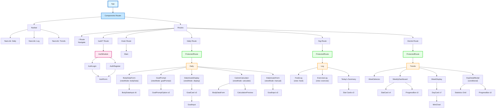
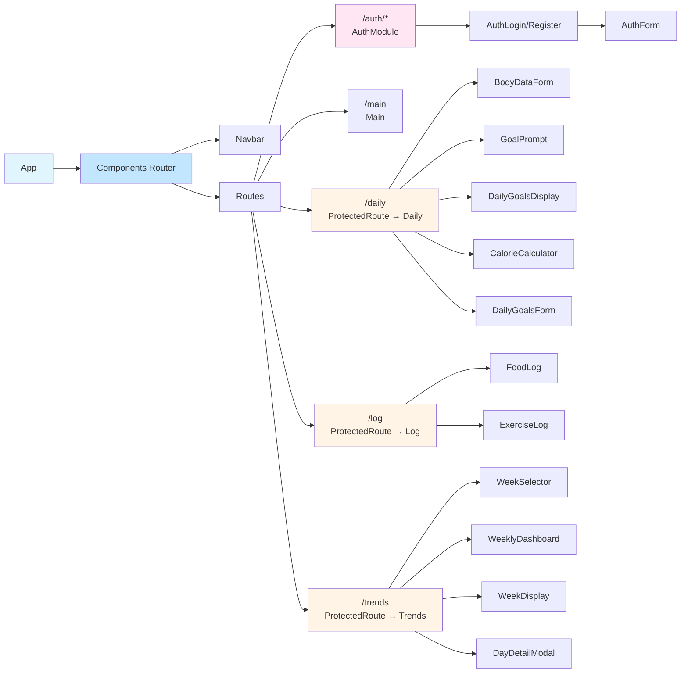

# Component Tree Diagram

## Wise Wizards Fitness Application

### Interactive Component Graph (Mermaid)

This graph shows the complete component hierarchy and relationships:

### Simplified High-Level Graph

For a clearer overview of the main routes:

## Component Details

### Core Routing Components
- **App**: Root component, initializes Parse SDK
- **Components**: Main router wrapper, manages authentication state
- **ProtectedRoute**: HOC that checks authentication before rendering protected pages
- **Navbar**: Navigation bar shown only when user is logged in

### Authentication Module
- **AuthModule**: Wrapper for login/register flow
- **AuthLogin**: Login form component
- **AuthRegister**: Registration form component
- **AuthForm**: Reusable form component for both login and register

### Main Features

#### Daily Goals Page
- **Daily**: Main container managing multiple view modes
- **BodyDataForm**: Form for entering body measurements
  - **BodyDataInput**: Reusable input component for body data fields
- **GoalPrompt**: Initial prompt to choose goal setting method
  - **GoalPromptOption**: Clickable option card
- **DailyGoalsDisplay**: Display current goals with edit capability
  - **GoalCard**: Display card for individual goal
  - **GoalInput**: Editable input component for goals
- **CalorieCalculator**: Calculator for automatic goal calculation
  - **CalculationPreview**: Preview of calculated goals
- **DailyGoalsForm**: Manual goal entry form
  - **GoalInput**: Input components for each goal type

#### Log Page
- **Log**: Main logging page container
- **FoodLog**: Food logging form with USDA API integration
- **ExerciseLog**: Exercise logging form

#### Trends Page
- **Trends**: Main trends/analytics page container
- **WeekSelector**: Week navigation controls
- **WeeklyDashboard**: Weekly summary statistics
  - **StatCard**: Reusable statistic display card
  - **ProgressBar**: Reusable progress bar component
- **WeekDisplay**: Grid of day cards for the week
  - **DayCard**: Individual day card
    - **MiniChart**: Mini bar chart showing day's stats
- **DayDetailModal**: Modal showing detailed day information
  - **ProgressBar**: Progress bars for goal tracking

### Shared/Reusable Components
- **StatCard**: Displays statistics in card format
- **ProgressBar**: Shows progress toward goals with color coding
- **MiniChart**: Mini bar chart for day cards
- **GoalInput**: Editable goal input field
- **BodyDataInput**: Body measurement input field

## Data Flow

### Services Layer
- **Services/AuthService**: Authentication operations
- **Services/Logs**: Daily log operations (food, exercise, aggregates)
- **Services/People**: User profile and goals management

### Utils Layer
- **Utils/dateUtils**: Date manipulation and formatting
- **Utils/statistics**: Statistical calculations
- **Utils/colors**: Color constants for theming
- **Utils/calculations**: Body data and calorie calculations

## State Management

- **Components**: Manages `currentUser` state (shared across app)
- **Daily**: Manages `viewMode` state (bodyData, goalPrompt, display, calculate, manual)
- **Log**: Manages `view` state (none, food, exercise)
- **Trends**: Manages week selection, day selection, loading states
- **AuthModule**: Manages auth `mode` state (login/register)

## Conditional Rendering Patterns

1. **Authentication-based**: Navbar, protected routes
2. **Mode-based**: Daily page (6 different view modes)
3. **View-based**: Log page (food/exercise forms)
4. **State-based**: Modal (DayDetailModal shown when day clicked)
5. **Data-based**: Empty states, loading states, error states

