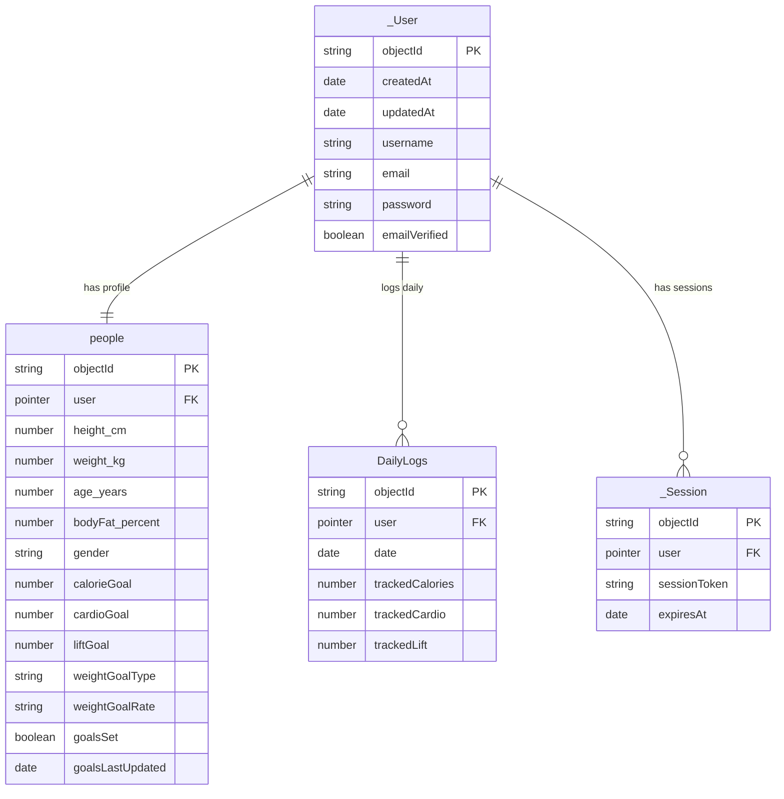

# Back4App Database UML Diagram

## Parse Server Database Schema

### UML Class Diagram (Mermaid)

```mermaid
classDiagram
    class _User {
        <<Parse Built-in>>
        +String objectId
        +Date createdAt
        +Date updatedAt
        +ACL ACL
        +String username
        +String password
        +String email
        +Boolean emailVerified
        +Object authData
    }
    
    class _Session {
        <<Parse Built-in>>
        +String objectId
        +Date createdAt
        +Date updatedAt
        +ACL ACL
        +Pointer~_User~ user
        +String installationId
        +String sessionToken
        +Date expiresAt
        +Object createdWith
    }
    
    class _Role {
        <<Parse Built-in>>
        +String objectId
        +Date createdAt
        +Date updatedAt
        +ACL ACL
        +String name
        +Relation~_User~ users
        +Relation~_Role~ roles
    }
    
    class people {
        <<Custom Class>>
        +String objectId
        +Date createdAt
        +Date updatedAt
        +ACL ACL
        +String username
        +String email
        +Pointer~_User~ user
        --Body Data--
        +Number height_cm
        +Number weight_kg
        +Number age_years
        +Number bodyFat_percent
        +String gender
        --Goals (Legacy)--
        +String caloriegoal
        +String cardiogoal
        +String liftgoal
        --Goals (Current)--
        +Number calorieGoal
        +Number cardioGoal
        +Number liftGoal
        +String weightGoalType
        +String weightGoalRate
        +Boolean goalsSet
        +Date goalsLastUpdated
    }
    
    class DailyLogs {
        <<Custom Class - Active>>
        +String objectId
        +Date createdAt
        +Date updatedAt
        +ACL ACL
        +Pointer~_User~ user
        +Date date
        +Number trackedCalories
        +Number trackedCardio
        +Number trackedLift
    }
    
    class day {
        <<Custom Class - Deprecated>>
        +String objectId
        +Date createdAt
        +Date updatedAt
        +ACL ACL
        +String date
        +Pointer~_User~ user
        +String username
        --Legacy Fields--
        +String trackedcalories
        +String trackedcardio
        +String trackedlift
        --New Fields--
        +Number trackedCalories
        +Number trackedCardio
        +Number trackedLift
    }
    
    class Logs {
        <<Custom Class - Deprecated>>
        +String objectId
        +Date createdAt
        +Date updatedAt
        +ACL ACL
        +Pointer~_User~ user
        +Date date
        +String type
        +String exerciseType
        +Number duration
        +String notes
        +String food
        +Number calories
    }
    
    class FoodLogs {
        <<Custom Class - Deprecated>>
        +String objectId
        +Date createdAt
        +Date updatedAt
        +ACL ACL
        +Pointer~_User~ user
        +Date date
        +String foodName
        +Number calories
    }
    
    class B4aVehicle {
        <<Unrelated Template>>
        +String objectId
        +Date createdAt
        +Date updatedAt
        +ACL ACL
        +String name
        +String color
        +Number price
    }
    
    %% Relationships
    _User ||--o{ _Session : "has"
    _User ||--|| people : "profile"
    _User ||--o{ DailyLogs : "logs"
    _User ||--o{ day : "has (deprecated)"
    _User ||--o{ Logs : "creates (deprecated)"
    _User ||--o{ FoodLogs : "creates (deprecated)"
    _User }o--o{ _Role : "assigned"
    
    note for DailyLogs "Primary class for daily tracking.\nReplaces day, Logs, and FoodLogs.\nOne row per user per day."
    note for day "Legacy class - being phased out"
    note for Logs "Legacy class - being phased out"
    note for FoodLogs "Legacy class - being phased out"
```

### Simplified Active Schema Diagram



## Class Descriptions

### Core Parse Classes (Built-in)

#### `_User`
**Purpose**: Parse Server's built-in user authentication class
- Stores user credentials (username, email, password)
- Handles authentication and session management
- One-to-one relationship with `people` profile

#### `_Session`
**Purpose**: Manages user sessions
- Automatically created when users log in
- Linked to `_User` via Pointer
- Contains session token and expiration

#### `_Role`
**Purpose**: Role-based access control (RBAC)
- Currently not actively used in the application
- Can assign users to roles for permissions

### Custom Application Classes

#### `people` ⭐ **Active**
**Purpose**: User profile and goals storage
- **Relationship**: One-to-one with `_User` (via `user` Pointer)
- **Fields**:
  - Body measurements (height, weight, age, body fat %, gender)
  - Goal settings (calorie, cardio, lifting goals)
  - Weight goal configuration (type, rate)
  - Timestamps for goal updates

#### `DailyLogs` ⭐ **Active (Primary)**
**Purpose**: Unified daily tracking for food and exercise
- **Relationship**: Many-to-one with `_User` (one user, many daily logs)
- **Uniqueness**: One row per user per day (enforced by application logic)
- **Fields**:
  - `date`: Date of the log entry
  - `trackedCalories`: Total calories consumed (aggregated)
  - `trackedCardio`: Total cardio minutes (aggregated)
  - `trackedLift`: Total lifting minutes (aggregated)
- **Replaces**: `day`, `Logs`, and `FoodLogs` classes

### Deprecated/Legacy Classes

#### `day` ⚠️ **Deprecated**
**Purpose**: Legacy daily tracking (being phased out)
- Similar to `DailyLogs` but with mixed field types
- Has both String and Number fields for same attributes
- Not used in current application code

#### `Logs` ⚠️ **Deprecated**
**Purpose**: Legacy exercise logging (being phased out)
- Individual exercise log entries
- Merged into `DailyLogs` aggregation
- Contains exercise type, duration, notes

#### `FoodLogs` ⚠️ **Deprecated**
**Purpose**: Legacy food logging (being phased out)
- Individual food log entries
- Merged into `DailyLogs` aggregation
- Contains food name and calories

#### `B4aVehicle` ❌ **Unrelated**
**Purpose**: Template/example class
- Not part of the Fitness Tracker application
- Can be safely ignored or removed

## Relationship Summary

### Active Relationships
1. **`_User` → `people`** (1:1)
   - Each user has exactly one profile record
   - Profile stores goals and body data

2. **`_User` → `DailyLogs`** (1:many)
   - Each user can have multiple daily log entries
   - One log entry per day per user
   - Contains aggregated daily statistics

3. **`_User` → `_Session`** (1:many)
   - Parse Server manages multiple sessions per user
   - Used for authentication

### Deprecated Relationships
- `_User` → `day` (replaced by `DailyLogs`)
- `_User` → `Logs` (replaced by `DailyLogs`)
- `_User` → `FoodLogs` (replaced by `DailyLogs`)

## Data Flow

```
User Registration/Login
    ↓
_User (authentication)
    ↓
people (profile & goals)
    ↓
Daily Logging
    ↓
DailyLogs (aggregated daily data)
    ↓
Trends/Analytics (queries DailyLogs)
```

## Field Type Notes

### Pointer Relationships
- `people.user` → Points to `_User`
- `DailyLogs.user` → Points to `_User`
- `_Session.user` → Points to `_User`

### Date Fields
- All classes have `createdAt` and `updatedAt` (Parse automatic)
- `DailyLogs.date` → Used for date-based queries (normalized to start of day)
- `people.goalsLastUpdated` → Tracks when goals were modified

### Number Fields
- Active classes use `Number` type consistently
- Legacy classes had `String` types that were converted to `Number`

## Index Recommendations

For optimal performance, consider indexing:
1. **DailyLogs**: `user` + `date` (compound index for daily queries)
2. **people**: `user` (unique index, one profile per user)
3. **DailyLogs**: `date` (for date range queries)

## Migration Notes

The application has migrated from:
- ❌ Individual entries (`Logs`, `FoodLogs`) 
- ❌ Separate aggregation (`day`)
- ✅ Unified aggregation (`DailyLogs`)

This ensures:
- One row per day per user
- Atomic updates for daily totals
- Simplified queries for trends and analytics

